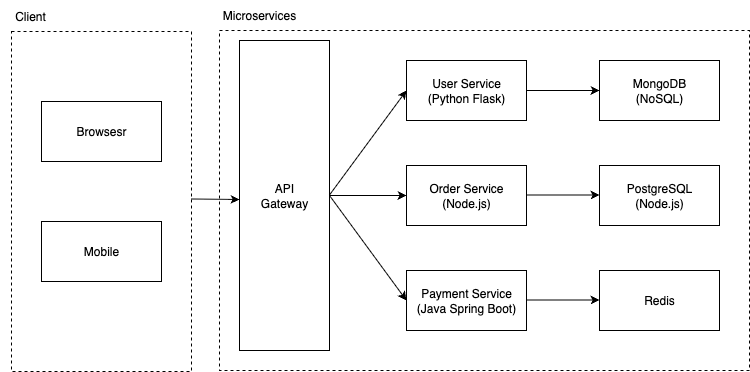

# Microservice Payment Simulator 💳

A simulated microservice-based payment platform with containerized services, CI/CD, and monitoring tools.

## Services
- `User Service`: Python Flask + MongoDB
- `Order Service`: Node.js Express + PostgreSQL
- `Payment Service`: Java Spring Boot + Redis

## Architecture

## Features
- RESTful APIs for user, order, and payment
- Dockerized deployment
- GitHub Actions CI/CD
- Prometheus + Grafana monitoring
- Centralized logging with Loki

## Status
Step 1: Project planning and structure completed ✅  
Step 2: Complete User Service (Flask + MongoDB) + Password Hashing + Clear Test API ✅

